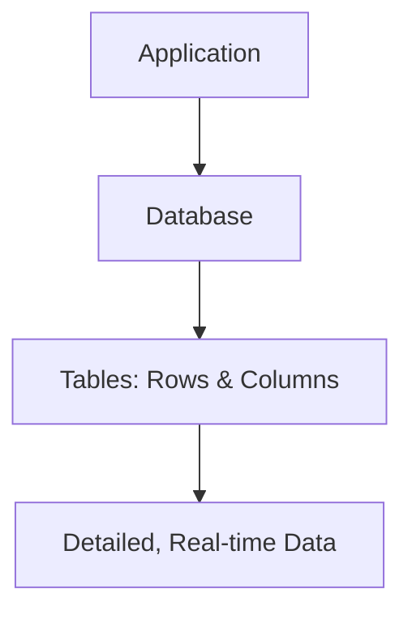
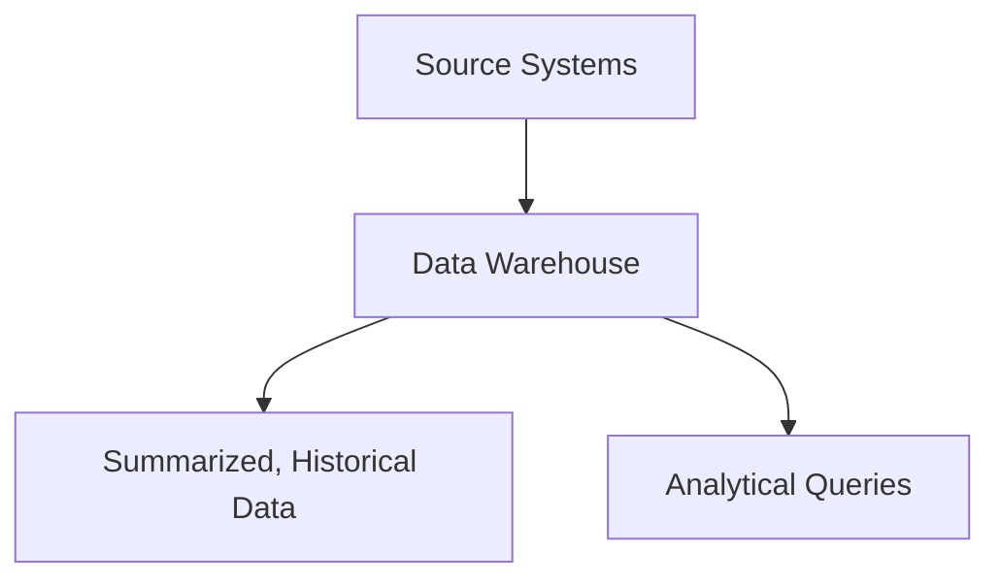
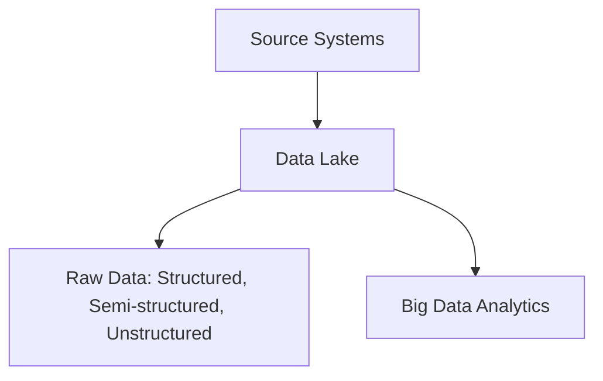

## Database

- Relational database
- designed to capture and record data (OLTP - Online Transactional Processing)
- Live real time data
- Data stored in tables with rows and columns
- data is highly detailed
- Flexible Schema (how the data is organized)

## Data Warehouse

- Relational Database
- Desinged for analytical processing (OLAP - Online Analytical Processing)
- Data is refreshed from source systems - stores current and historical
- Data is summarized
- Rigid Schema (how the data is organized)

## Data Mart
A data mart is a smaller, specialized subset of a data warehouse that is focused on a specific business area, department, or subject (such as sales, finance, or marketing).

- It contains data relevant to a particular group of users.
- Data marts are designed to make data access faster and more efficient for specific needs.
- They can be created from a data warehouse or directly from source systems.

**Example:**  
A company’s sales department might have its own data mart containing only sales-related data, separate from the company’s overall data warehouse.

## Data Lake

- Relational Database
- Designed to capture raw data (strucutured, semi-strucutres, unstructured)
- Made for large amountd of data
- Used for ML and AI in its current state or for Analytics with processing
- Can organize and put into Databases or Data Warehouses
## OLTP (Online Transaction Processing):

Handles day-to-day transactional data (insert, update, delete).
Optimized for fast query processing and maintaining data integrity in multi-access environments.
Example: Banking systems, order entry, retail sales.

## OLTP (Online Transaction Processing):

Handles day-to-day transactional data (insert, update, delete).
Optimized for fast query processing and maintaining data integrity in multi-access environments.
Example: Banking systems, order entry, retail sales.
OLAP (Online Analytical Processing):

Handles complex queries for data analysis and business intelligence.
Optimized for reading large amounts of data and aggregating information.
Example: Data warehouses, reporting systems, trend analysis.

| Feature      | OLTP (Online Transaction Processing) | OLAP (Online Analytical Processing) |
|-------------|--------------------------------------|-------------------------------------|
| Purpose     | Transaction processing               | Analytical processing               |
| Operations  | Insert, Update, Delete               | Read, Aggregate, Analyze            |
| Data Volume | Small, current data                  | Large, historical data              |
| Speed       | Fast for transactions                | Fast for complex queries            |
| Example     | ATM, e-commerce, POS                 | Data warehouse, BI reporting        |

## Key Differences: Database vs Data Warehouse vs Data Lake

| Feature         | Database                        | Data Warehouse                        | Data Lake                                 |
|----------------|----------------------------------|----------------------------------------|--------------------------------------------|
| Purpose        | Transactional processing         | Analytical processing                  | Store all types of raw data                |
| Data Type      | Structured                       | Structured (often summarized)          | Structured, semi-structured, unstructured  |
| Data Source    | Current, real-time data          | Historical data from multiple sources  | All data, including logs, images, etc.     |
| Schema         | Rigid or flexible                | Rigid (predefined schema)              | Schema-on-read (flexible)                  |
| Users          | Operational staff, apps          | Analysts, business intelligence        | Data scientists, engineers, analysts       |
| Processing     | Fast transactions (OLTP)         | Complex queries, aggregations (OLAP)   | Big data analytics, machine learning       |
| Cost           | Moderate                         | Higher (due to performance tuning)     | Lower for storage, higher for processing   |
| Example        | Banking, e-commerce, ERP         | Reporting, trend analysis, BI          | IoT, social media, raw logs, images        |