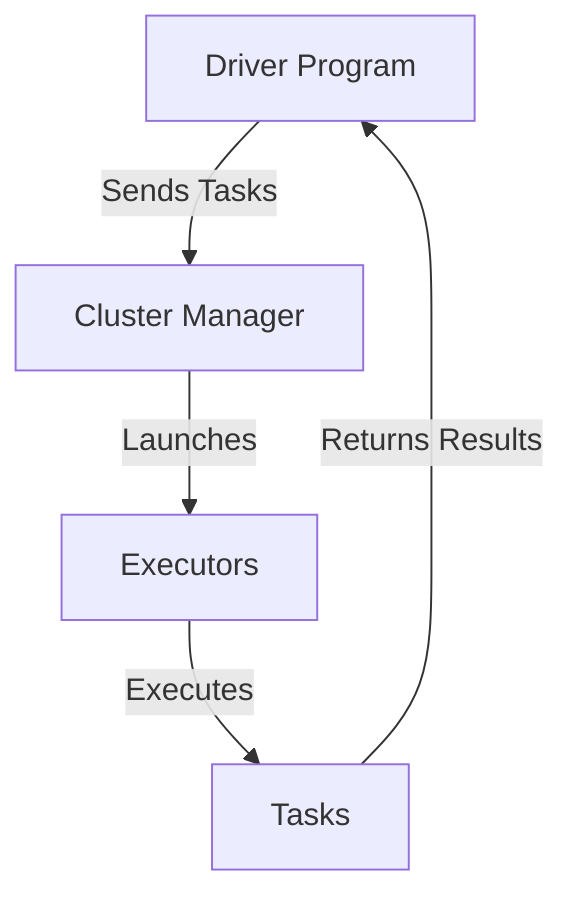

# PySpark Learning Guide for Beginners

## Table of Contents
1. [Introduction to PySpark](#introduction-to-pyspark)
2. [PySpark Architecture](#pyspark-architecture)
3. [Setting Up PySpark](#setting-up-pyspark)
4. [Core Concepts](#core-concepts)
    - RDDs
    - DataFrames
    - Transformations & Actions
5. [Data Processing with PySpark](#data-processing-with-pyspark)
6. [Advanced Topics](#advanced-topics)
    - Spark SQL
    - Machine Learning with MLlib
    - Performance Tuning
7. [Interview Preparation Tips](#interview-preparation-tips)

---

## 1. Introduction to PySpark

PySpark is the Python API for Apache Spark, an open-source distributed computing system for big data processing and analytics.

---

## 2. PySpark Architecture


- **Driver Program:** Runs the main function and creates SparkContext.
- **Cluster Manager:** Allocates resources (YARN, Mesos, Standalone).
- **Executors:** Run computations and store data.

---

## 3. Setting Up PySpark

- Install using pip:  
  ```bash
  pip install pyspark
  ```
- Start a Spark session:
  ```python
  from pyspark.sql import SparkSession
  spark = SparkSession.builder.appName("example").getOrCreate()
  ```

---

## 4. Core Concepts

### RDDs (Resilient Distributed Datasets)

- Immutable distributed collections of objects.
- Created from data or by transforming other RDDs.


### DataFrames

- Distributed collection of data organized into named columns.
- Similar to Pandas DataFrame but distributed.

```python
df = spark.read.csv("data.csv", header=True, inferSchema=True)
df.show()
```

### Transformations & Actions

- **Transformations:** Lazy operations (e.g., `map`, `filter`).
- **Actions:** Trigger computation (e.g., `collect`, `count`).

---

## 5. Data Processing with PySpark

- **Reading Data:**
  ```python
  df = spark.read.csv("file.csv", header=True)
  ```
- **Filtering Data:**
  ```python
  df_filtered = df.filter(df['age'] > 21)
  ```
- **Aggregations:**
  ```python
  from pyspark.sql import functions as F
  df.groupBy("city").agg(F.avg("salary")).show()
  ```

---

## 6. Advanced Topics

### Spark SQL

- Query data using SQL syntax.
  ```python
  df.createOrReplaceTempView("people")
  spark.sql("SELECT * FROM people WHERE age > 30").show()
  ```

### Machine Learning with MLlib

- Built-in library for scalable machine learning.
  ```python
  from pyspark.ml.classification import LogisticRegression
  lr = LogisticRegression()
  model = lr.fit(training_data)
  ```

### Performance Tuning

- Partitioning, caching, and resource allocation.
- Use `.cache()` to persist data in memory.

---

## 7. Interview Preparation Tips

- Understand Spark architecture and execution flow.
- Practice writing PySpark code for data transformations.
- Learn about optimization techniques (partitioning, caching).
- Review Spark SQL and MLlib basics.

---

## Additional Resources

- [PySpark Documentation](https://spark.apache.org/docs/latest/api/python/)
- [Databricks PySpark Guide](https://docs.databricks.com/getting-started/quick-start.html)
